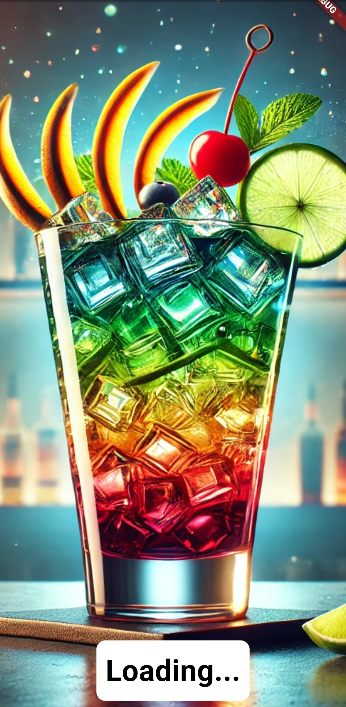
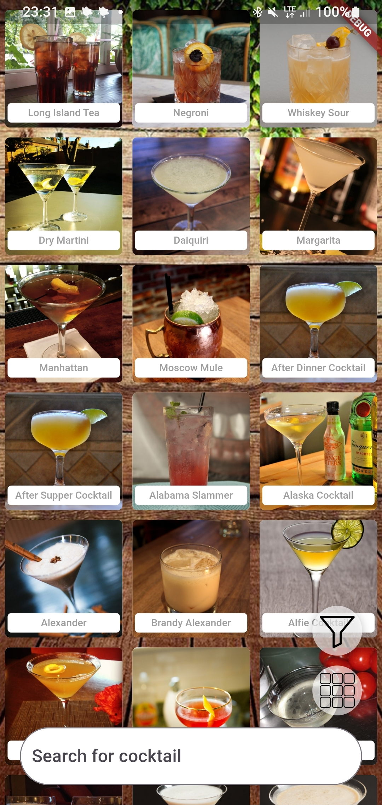
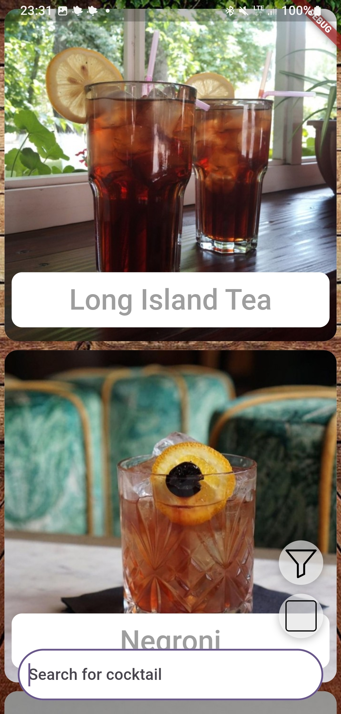
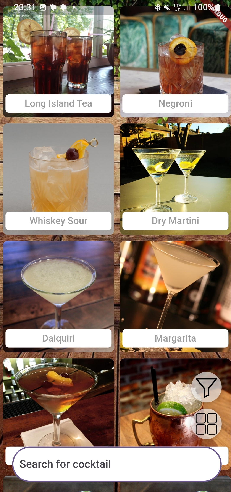
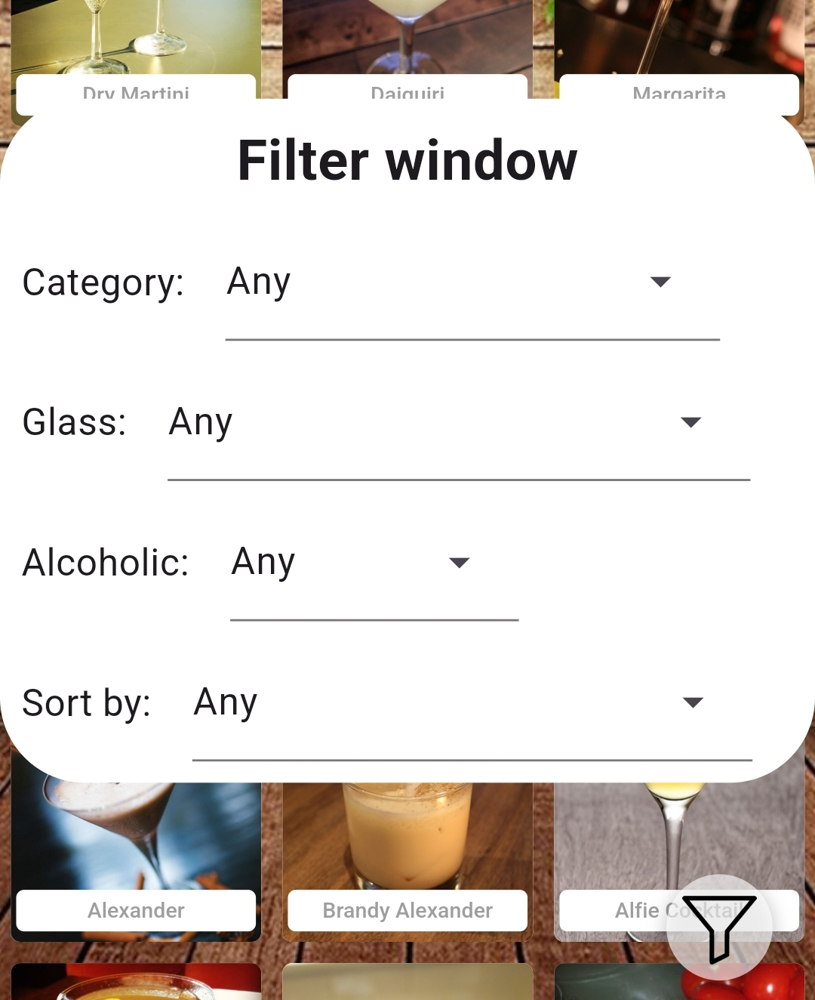
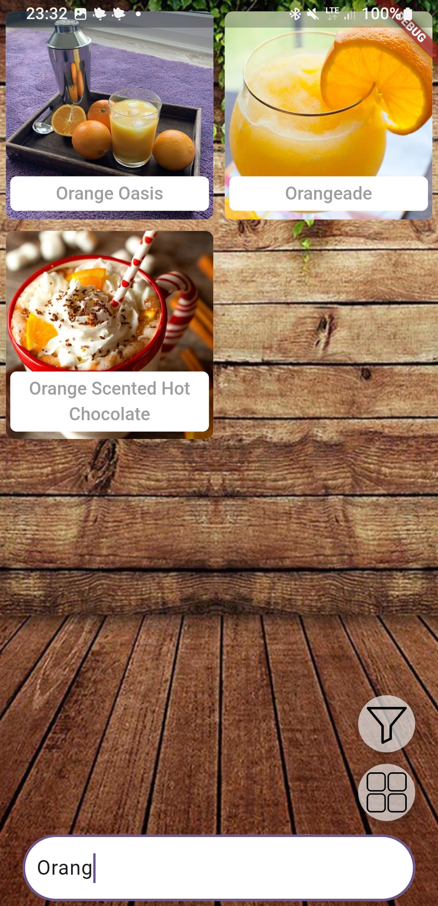
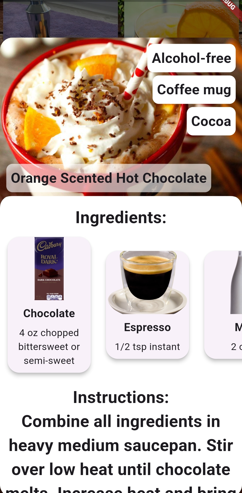

# rekrutacja solvro mobile 2024
This app will show you cocktails, their photos, ingredients and intructions to prepare them.  
I really like the outcome, and I hope you will like it too :) 

## User experience
When you open an app, you will encounter a loading page. If there is no internet connection - you will be prompted to turn it on.

 

Then you will be placed in the main page of the app. Yes, it's an infinite scroller! Just scroll it down to get more cocktails :)

 

You can easily change the displayed grid clicking on the button in the right bottom corner (just above the text input).  
Here is the setting for one image in the row: 
 
And here is the setting for 2 images in the row: 
 
And by default you begin with 3 images in the row. So whenever you are on a bigger machine or just on a little phone, you can easily enhance your browsing experience :)

But that's not all! 
You are also granted with the filter window 
 
Here you can filter various details of your cocktail and also you can easily sort it. And once you click again on the filter button, you will get what you wanted :)  
You can also find your cocktail recipe by searching it by name easily in the text field in the bottom of the screen:  
 
And once you find it what you wanted, just click on the cocktail to see all the details and information how to prepare it. 
 
Now you are ready to prepare the best cocktail in your life!

# Specification
 - Project done entirely in flutter in dart.

### Implemented:
- listing and displaying cocktails and their details
- searching / filtring / sorting cocktails
- fetching and caching cocktails from the CocktailApi
- Infinite Scroll
- Debouncing when searching
- Caching requests (see Services/DataCacher (for cocktails and ingredients and Services/DataManagerSingleton for request with their unique id to Cocktails)
- Caching cocktail and ingredient images using CachedNetworkImageProvider utility.
- custom cocktail grid with its animation
- And many more!

There is also limited responsiveness ( sorry I ran out of time, my bad :(

# Troubleshoot
If at any point, any error occured, feel free to share in the issues tab.
